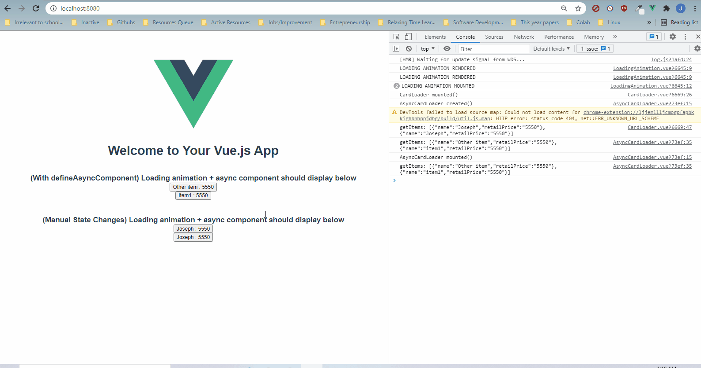

# vue-playground

Demonstration of async loading with Vue 3 (no Suspense, since that is still an experimental feature as of 8/1/21).



In this repo, the `AsyncCardLoader` asynchronously and independently gets the display item list and renders the buttons. `HelloWorld` encapsulates `AsyncCardLoader` with `defineAsyncComponent` and `LoadingAnimation`.

However, as you can see, the loading animation disappears almost immediately after rendering. This contrasts with the manually loading strategy, where the loading works pretty flawlessly.

Why?

From the [documentation for `defineAsyncComponent`](https://github.com/vuejs/vue-next/blob/47f488350c53db2bd9682e0c27a4f1dbcdab162a/packages/runtime-core/src/apiAsyncComponent.ts), `loadingComponent` only renders if:

1. The component in `loader()` has not been resolved.
2. There is no error.

The snippet is as shown below:

```
        if (loaded.value && resolvedComp) {
          return createInnerComp(resolvedComp, instance)
        } else if (error.value && errorComponent) {
          return createVNode(errorComponent as ConcreteComponent, {
            error: error.value
          })
        } else if (loadingComponent && !delayed.value) {
          return createVNode(loadingComponent as ConcreteComponent)
        }
```

`loaded.value` only becomes `true` when `load()` resolves. `load()` is an internal function in `defineAsyncComponent`:

```
  const load = (): Promise<ConcreteComponent> => {
    let thisRequest: Promise<ConcreteComponent>
    return (
      pendingRequest ||
      (thisRequest = pendingRequest =
        loader()
          .catch(err => {
            err = err instanceof Error ? err : new Error(String(err))
            if (userOnError) {
              return new Promise((resolve, reject) => {
                const userRetry = () => resolve(retry())
                const userFail = () => reject(err)
                userOnError(err, userRetry, userFail, retries + 1)
              })
            } else {
              throw err
            }
          })
          .then((comp: any) => {
            if (thisRequest !== pendingRequest && pendingRequest) {
              return pendingRequest
            }
            if (__DEV__ && !comp) {
              warn(
                `Async component loader resolved to undefined. ` +
                  `If you are using retry(), make sure to return its return value.`
              )
            }
            // interop module default
            if (
              comp &&
              (comp.__esModule || comp[Symbol.toStringTag] === 'Module')
            ) {
              comp = comp.default
            }
            if (__DEV__ && comp && !isObject(comp) && !isFunction(comp)) {
              throw new Error(`Invalid async component load result: ${comp}`)
            }
            resolvedComp = comp
            return comp
          }))
```

So, `load()` controls the value of `loaded` and `resolvedComp`.

Ignoring error handling, `load()`:

1. Calls the `loader()` and waits for it to resolve.
2. When the `loader` resolves, set resolvedComp = import component.

So, if the component has been imported and "loaded," the loading animation will stop!

[This medium article](https://medium.com/@HcySunYang/how-to-manage-asynchronous-calls-more-easily-in-vue-apps-52f001fc136f) points out this issue:

> > If the async component itself still has asynchronous calls, such as the request API, **the hiding of the loading component will not wait for the API request to complete.**

## Next Steps

[This article](https://itnext.io/vuejs-tricks-1-async-component-wrapper-f3bdbaa8dd86) covers a wrapper using `defineAsyncComponent`.

The wrapper is located [here](https://github.com/mazlum/vue-async-component-example/blob/master/src/components/AsyncComponent.vue).

[This article](https://lukashermann.dev/writing/vuejs-async-renderless-component/) provides another clean manual solution for async components (recommend!).

---

## Project setup

```
yarn install
```

### Compiles and hot-reloads for development

```
yarn serve
```

### Compiles and minifies for production

```
yarn build
```

### Lints and fixes files

```
yarn lint
```

### Customize configuration

See [Configuration Reference](https://cli.vuejs.org/config/).
